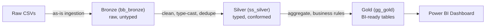

# 🚀 E-Commerce Data Pipeline (Bronze ➔ Silver ➔ Gold)

🔗 **Live Interactive Dashboard:** [View Live Project](https://hamed7848.github.io/E-commerce-supply-chain/)

A SQL-based medallion-architecture data pipeline built on a synthetic
e-commerce dataset (customers, products, inventory, suppliers, marketing,
pricing, transactions and returns). Raw CSVs are ingested as-is (**Bronze**),
cleaned and typed (**Silver**), then aggregated into business-ready tables
(**Gold**) for BI reporting.

## Architecture



| Layer | Database | Purpose |
|---|---|---|
| **Bronze** | `bb_bronze` | Raw data loaded exactly as received. Every column is text. No cleaning, no casting. |
| **Silver** | `ss_silver` | Typed, trimmed, de-duplicated tables. One row per business key. |
| **Gold** | `gg_gold` | Pre-aggregated, denormalized tables ready to plug straight into a BI tool. |

## Repository structure

```
ecommerce-data-pipeline/
├── README.md
├── data/
│   └── raw/                          # sample of the 8 source CSVs
│       ├── customers.csv
│       ├── products.csv
│       ├── inventory.csv
│       ├── supplier_costs.csv
│       ├── marketing_spend.csv
│       ├── price_history.csv
│       ├── transactions.csv
│       └── returns.csv
├── sql/
│   ├── bronze/
│   │   └── bronze_mysql_schema.sql
│   ├── silver/
│   │   ├── ss_silver_schema.sql
│   │   └── ss_silver_load.sql
│   └── gold/
│       ├── gg_gold_schema.sql
│       └── gg_gold_load.sql
├── docs/
│   └── data_dictionary.md            # column-level description of every dataset
└── dashboards/
    └── ecommerce_dashboard.pbix       # (add your Power BI file here)
```

## Gold layer tables (what the dashboard reads from)

| Table | Grain | Used for |
|---|---|---|
| `gold_customer_360` | 1 row / customer | Customer LTV, churn segmentation (Active / At Risk / Churned) |
| `gold_product_performance` | 1 row / product | Sales, margin, return rate, stock status per product |
| `gold_sales_monthly_summary` | 1 row / month | Company-wide monthly KPIs |
| `gold_sales_by_category_channel` | 1 row / month+category+channel | Sales breakdown for slicing in Power BI |
| `gold_marketing_performance` | 1 row / month+channel | Reported marketing KPIs vs. actual sales outcome |
| `gold_inventory_status` | 1 row / product | Stock health and days-of-supply |

## How to run

```bash
# 1) Bronze - load raw CSVs as-is
mysql -u your_user -p < sql/bronze/bronze_mysql_schema.sql
python3 sql/bronze/bronze_mysql_load.py     # or your own CSV import method

# 2) Silver - clean, type, de-duplicate
mysql -u your_user -p < sql/silver/ss_silver_schema.sql
mysql -u your_user -p < sql/silver/ss_silver_load.sql

# 3) Gold - aggregate into BI-ready tables
mysql -u your_user -p < sql/gold/gg_gold_schema.sql
mysql -u your_user -p < sql/gold/gg_gold_load.sql
```

Requires MySQL 8.0+ or MariaDB 10.2+ (window functions are used in the
Silver load step for de-duplication).

## Tech stack

- **SQL** (MySQL/MariaDB) — schema design, ETL, aggregation
- **Python (Pandas)** — CSV ingestion into Bronze
- **Power BI** — final reporting layer on top of the Gold tables

## Data dictionary

See [`docs/data_dictionary.md`](docs/data_dictionary.md) for column-level
definitions of all 8 source datasets.

## Notes

This is a portfolio project built on a synthetic dataset to demonstrate
a full Bronze/Silver/Gold pipeline design: raw ingestion, data cleaning
and typing, business-rule aggregation, and BI-ready output.
